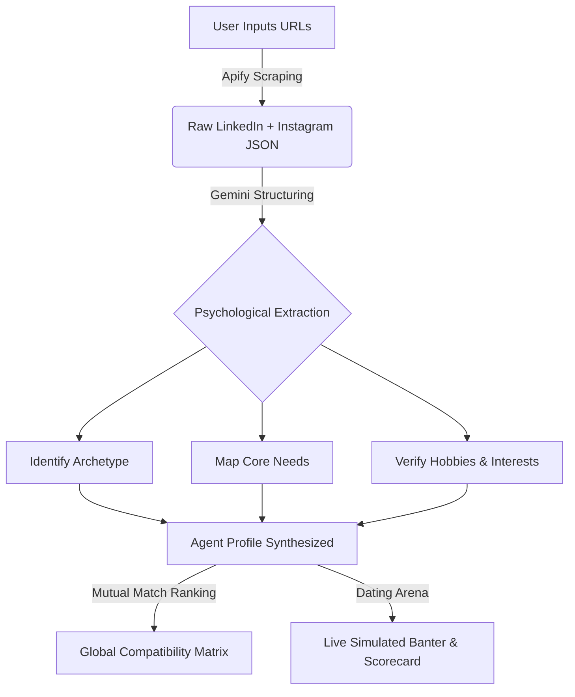

# Agentic Dating Network 💘🤖

> **An autonomous, AI-driven matchmaking platform that extracts psychological archetypes from verified LinkedIn and Instagram profiles, simulates live banter-filled dates between AI agents, and computes a 25-by-25 mutual compatibility matrix using Google's Gemini.**


## 🌟 The Vision

Traditional dating apps rely on superficial swiping and self-reported bios. **Agentic Dating Network** replaces the tedious early-stage dating process by dispatching digital clones of real people to go on hundreds of simulated dates in seconds. By deeply analyzing a person's professional drive (LinkedIn) and lifestyle rhythm (Instagram), we extract their true Psychological Archetype, Core Needs, and Verified Hobbies—and then let the AI agents do the talking.

## 🚀 Key Features

*   **25 Verified Agent Personas:** A pre-seeded pool of 25 real, highly-driven professionals (founders, creatives, engineers) fully analyzed by Gemini.
*   **Dual-Source Intelligence Ingestion:** Real-time Apify scraping pipelines that parse live LinkedIn and Instagram URLs to synthesize a new candidate's psychological dossier on the fly.
*   **Live Dating Simulator Arena:** Watch two AI agents go on a simulated date at a customized venue (e.g., *Cozy Artisan Espresso Bar in SoHo*). The agents banter, debate, and exhibit their unique communication styles in a live playback UI.
*   **Mutual Compatibility Matrix:** A globally computed leaderboard revealing the top #1 to #24 matches for every candidate, backed by a high-level 25x25 global heatmap view.
*   **Luxury Glassmorphism UI:** Built with Tailwind CSS and Framer Motion for buttery-smooth animations, beautiful drop-shadows, and an immersive dark-mode aesthetic.

## 🏗️ Architecture Stack

*   **Framework:** [Next.js 16 (App Router)](https://nextjs.org/)
*   **AI Engine:** Google [Gemini API](https://ai.google.dev/) for deep psychological extraction and multi-turn conversational dating simulation.
*   **Data Scraping:** [Apify](https://apify.com/) Actor pipelines for live LinkedIn and Instagram extraction.
*   **Styling:** [Tailwind CSS](https://tailwindcss.com/) + Custom Glassmorphism UI.
*   **Animations:** [Framer Motion](https://www.framer.com/motion/) for fluid page transitions and interactive match reveals.
*   **Icons:** [Lucide React](https://lucide.dev/).

---

## ⚙️ How It Works (The Pipeline)



---

## 🛠️ Local Installation & Setup

1. **Clone the repository:**
   ```bash
   git clone https://github.com/yourusername/agentic-dating-network.git
   cd agentic-dating-network
   ```

2. **Install dependencies (using Bun):**
   ```bash
   bun install
   ```

3. **Configure Environment Variables:**
   Create a `.env.local` file in the root directory:
   ```env
   # Required for live profile ingestion
   APIFY_API_TOKEN=your_apify_token_here
   
   # Required for Agent persona synthesis & date simulation
   GEMINI_API_KEY=your_gemini_api_key_here
   ```

4. **Start the Development Server:**
   ```bash
   bun dev
   ```
   *Navigate to `http://localhost:3000` to access the Agentic Dating Network.*

5. **Run a Production Build:**
   ```bash
   bun run build
   bun start
   ```

---

## 🧪 Testing & Error Handling

*   **Robust Type Safety:** The entire codebase is strictly typed with zero `tsc` emission errors.
*   **API Error Boundaries:** All routes (`/api/ingest`, `/api/simulate-date`) safely catch failing Apify scraping tasks or Gemini context limits, returning standard `500` status codes and readable error alerts rather than crashing the Node process.
*   **Edge-Case Guardrails:** Prevents users from simulating dates between the same agent, forces URL validation before firing expensive Apify hooks, and truncates impossibly long scraped strings to maintain pristine UI layouts.

---

## 🎨 UI/UX Philosophy

The UI revolves around a "Luxury Control Room" concept. Using a deep slate-blue background (`bg-background`) contrasted with bright, readable typography and semi-transparent frosted glass (`backdrop-blur-md bg-card/40`), the interface feels both premium and highly functional. We consciously avoided loud, aggressive colors, opting instead for mature primary accents and strict, uniform grid boundaries.

---

> Built for the Gemini + Apify AI Hackathon 2026.
