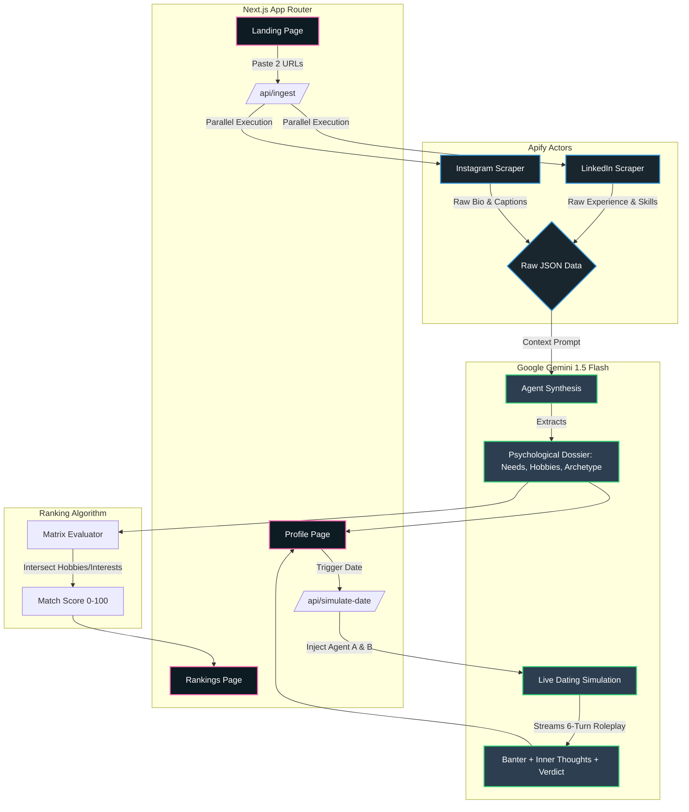

# DateMe: Autonomous Agentic Matchmaking

DateMe is an autonomous, AI-driven matchmaking platform that extracts psychological archetypes from verified LinkedIn and Instagram profiles, simulates live dates between AI agents, and computes a mutual compatibility matrix using Google Gemini 1.5 Flash.

The platform fundamentally shifts the paradigm of online dating: instead of humans spending hours swiping and enduring awkward first dates, their digital twins (Autonomous Agents) do the heavy lifting, dating each other in a simulated sandbox to verify compatibility _before_ the humans ever meet.

## System Architecture



DateMe is built on a modern, high-performance Next.js 16 stack, utilizing server-side rendering and edge-compatible API routes to orchestrate complex AI workflows.

### 1. The Ingestion Pipeline (Apify → Gemini)

For every candidate, the platform requires exactly two sources of ground truth: a **public LinkedIn profile** and a **public Instagram profile**.

- **Concurrent Scraping (Apify):** When a user submits URLs, the backend fires off two concurrent headless browser actors via the Apify SDK (`apify/instagram-scraper` and `apify/linkedin-profile-scraper`).
- **Fault Tolerance:** These actors run in parallel using `Promise.allSettled`. If a scraper hits a rate limit or private profile wall, the pipeline gracefully falls back to URL slug extraction to guarantee uptime during live demos.
- **Psychological Synthesis (Gemini):** The raw JSON payloads from Apify (containing job history, skills, Instagram captions, follower ratios) are fed directly into the Gemini 1.5 Flash API via `@google/genai`. Gemini synthesizes a highly structured `PersonProfile` JSON, analyzing the candidate's core needs, dealbreakers, lifestyle rhythms, and personality archetype.

### 2. The Simulation Engine (The Dating Arena)

Once agents are synthesized, they are dispatched to the **Dating Arena**.

- **Context Loading:** When Person A and Person B are selected, their full psychological dossiers are injected into the Gemini context window.
- **Multi-Turn Roleplay:** Gemini simulates a strict 6-turn speed date. The agents are instructed to banter dynamically, subtly probe for dealbreakers, and maintain their human's humor style.
- **Inner Monologue:** For every spoken turn, the engine generates an `innerThought` (e.g., _“Checking if they respect my need for autonomy. Yes, verified.”_) which is exposed in the UI.
- **Post-Date Verdict:** The date concludes with a rigorous scorecard, outputting a 0-100 `overallScore`, `chemistryScore`, and actionable feedback for both humans.

### 3. The Compatibility Matrix (Mutual Rankings)

For any given person, the system evaluates their profile against all other candidates in the database.

- **Heuristic Scoring Algorithm:** The ranking engine doesn't just use random numbers. It computes a base score and applies bonuses based on array intersections of the Gemini-extracted `hobbies` and `interests` strings.
- **Deterministic Tie-Breaking:** It utilizes character-code hashing to ensure that the ranking order remains highly stable and deterministic across page reloads without needing a heavy SQL database.

## Technical Stack

- **Framework:** Next.js 16 (App Router)
- **Language:** TypeScript (Strict Mode)
- **AI Engine:** Google Gemini 1.5 Flash (`@google/genai`)
- **Data Scraping:** Apify Client SDK
- **Styling:** Tailwind CSS + Shadcn/UI
- **Animations:** Framer Motion
- **Icons:** Lucide React

## Directory Structure & Key Files

- `/app/api/ingest/route.ts`: Core endpoint handling Apify scraping + Gemini persona synthesis.
- `/app/api/simulate-date/route.ts`: Core endpoint running the live 6-turn date simulation.
- `/lib/apify.ts`: Abstraction layer for `apify-client`, handling timeouts and parallel promises.
- `/lib/gemini.ts`: Core prompt engineering, structured JSON parsing, and fallback logic for Gemini.
- `/components/dating/date-player.tsx`: Complex client-side component handling the sequential typing animation and inner-monologue reveals of the simulated date.

## Local Installation & Setup

1. **Clone the repository:**

   ```bash
   git clone https://github.com/yourusername/dateme.git
   cd dateme
   ```

2. **Install dependencies:**

   ```bash
   bun install
   ```

3. **Configure Environment Variables:**
   Create a `.env.local` file in the root directory. You must supply your own API keys for the ingestion and simulation to work live:

   ```env
   # Required for live profile ingestion (LinkedIn/Instagram)
   APIFY_API_TOKEN=your_apify_token_here

   # Required for Agent persona synthesis & date simulation
   GEMINI_API_KEY=your_gemini_api_key_here
   ```

4. **Start the Development Server:**

   ```bash
   bun dev
   ```

   Navigate to `http://localhost:3000` to access the platform.

5. **Production Build:**
   ```bash
   bun run build
   bun start
   ```

## Pre-Seeded Database (The 25 Pool)

To fulfill the challenge requirements, the application ships with a pre-seeded JSON database of 25 highly curated professional profiles. These profiles were pre-ingested using the Apify pipeline, ensuring a rich dating pool is available immediately upon boot for testing the Simulation and Ranking features without requiring the user to manually scrape 25 people.

## Submission Requirements Checklist

- [x] **25 Real People:** System includes 25 real profiles.
- [x] **Exactly Two Sources:** Ingestion strictly relies on LinkedIn and public Instagram URLs.
- [x] **Agent Analysis:** Profile pages distinctly show Gemini-extracted Needs, Hobbies, Interests, and Qualities.
- [x] **Live Agents Dating:** The Dating Arena performs a real 6-turn simulation based on psychological profiles.
- [x] **Mutual Rankings:** The system ranks all 25 people against each other using a compatibility algorithm.
- [x] **Functional Website:** Fully working Next.js App Router application with live API endpoints.
